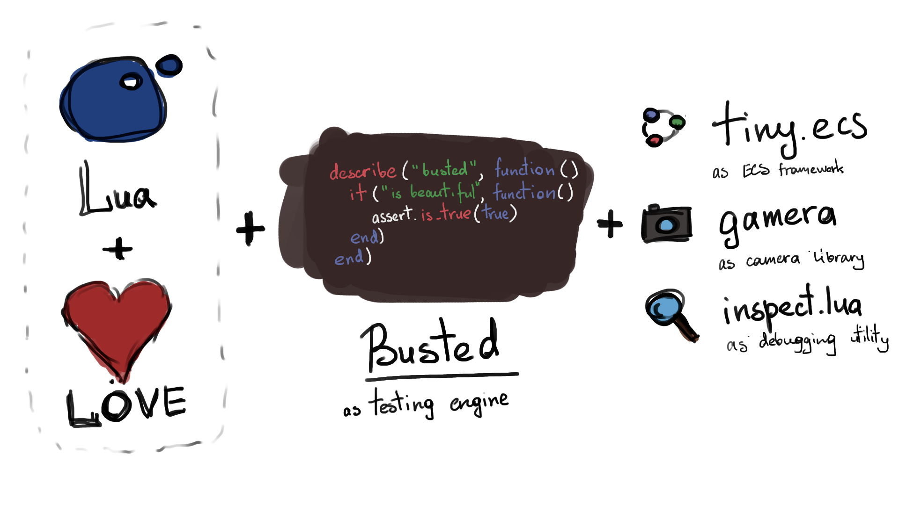

# Eros as a game engine

Eros game engine includes:

 - *LÖVE* as parent engine
 - *busted* as testing system
 - *tiny.ecs* as Entity-Component-System framework
 - *eros* as development optimization utility
 - *gamera* as camera library
 - *inspect.lua* as debug utility

# Eros as a devops utility

Basic functionality:

```bash
eros init  # In development
eros test
eros launch
eros build  # In development
eros commit
```

Refactoring:

```bash
eros move soldier assets/units/soldier  # In development
```